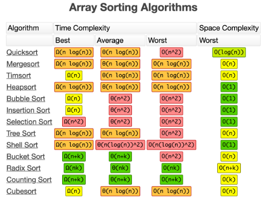

# Line 1
## Line 2
### Line 3

1. line1
    1. fsdf
        1. dasf
2. line 2
3. line 3
1. line 4
1. line 5

- line 1
- line 2
    - line 3
        - line 4
    - line 5
- line 6

print("hello world")

**print("hello world")**

`print("hello world")`

*print("hello world")*

```python
print("hello world")
```

```java
System.out.println("hello gokul");
```



- what is mergesort:
    - 